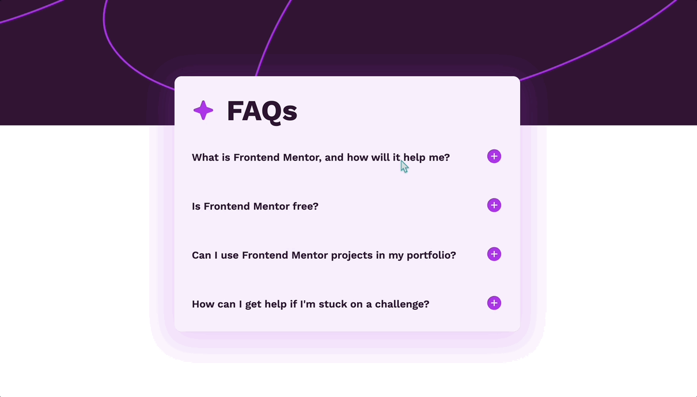

# FAQ Accordion

Essa é uma solução para o [Desafio: "FAQ Accordion" do Frontend Mentor](https://www.frontendmentor.io/challenges/faq-accordion-wyfFdeBwBz). Os desafios que esse site oferece ajuda desenvolvedores a melhorar suas habilidades de código!

## O Desafio

### Requisitos

Usuários devem poder ver:

- Mostrar/esconder as respostas das perguntas que forem clicadas

- O layout ideal para o conteúdo dependendo do tamanho da tela do dispositivo

- Estados hover para todos os elementos interativos da página

## Tecnologias Utilizadas

- HTML

- CSS

- JavaScript

## Aprendizado

- Pratiquei a lógica de programação com JavaScript, adicionando eventos e manipulando o DOM.

## Preview

